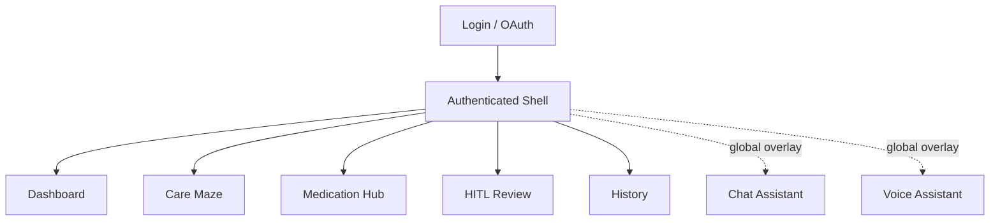
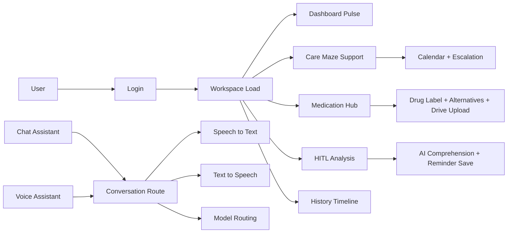

# Design System Specification: The Nurturing Hearth

## 1. Overview & Creative North Star
**Creative North Star: "The Digital Sanctuary"**

This design system rejects the cold, sterile efficiency of traditional healthcare interfaces in favor of a "Sanctuary" aesthetic. We are building a space that feels like a sun-drenched living room—safe, quiet, and deeply human. 

To achieve this, we move beyond the "template" look by embracing **Organic Editorialism**. This means prioritizing generous whitespace (the "breath" of the UI), intentional asymmetry in layout, and a rejection of the rigid grid. We avoid the clinical "boxed-in" feel by overlapping elements and using tonal depth rather than structural lines. The result is a premium, high-end experience that feels curated rather than manufactured.

---

## 2. Colors & Surface Philosophy
Our palette is rooted in the earth: Sage (`primary`), Terracotta (`secondary`), and Sand (`tertiary`). These are supported by a foundation of cream and off-white to maintain warmth.

### The "No-Line" Rule
**Lines are scars on a clean canvas.** In this system, 1px solid borders for sectioning are strictly prohibited. Boundaries must be defined exclusively through:
*   **Background Shifts:** Transitioning from `surface` to `surface-container-low`.
*   **Tonal Transitions:** Using subtle shifts in the cream/beige spectrum to define edge cases.

### Surface Hierarchy & Nesting
Treat the UI as a series of physical layers—stacked sheets of fine, textured paper.
*   **Base:** `surface` (#fcfaee) – The desk on which everything sits.
*   **Sections:** `surface-container-low` (#f6f4e8) – Defining broad areas of interest.
*   **Focal Points:** `surface-container-highest` (#e5e3d7) – For interactive elements that require immediate attention.

### The "Glass & Gradient" Rule
To add "soul," use subtle, long-form gradients for primary CTAs and Hero sections. Transition from `primary` (#536431) to `primary-container` (#879a61) at a 135-degree angle. For floating navigation or modal overlays, utilize **Glassmorphism**: use `surface-container-lowest` at 85% opacity with a `20px` backdrop-blur to create a "frosted glass" effect that keeps the user grounded in their current context.

---

## 3. Typography: The Editorial Voice
We use a high-contrast scale to create an authoritative yet gentle hierarchy.

*   **The Anchor (Noto Serif):** Used for `display` and `headline` tiers. This serif provides a sense of history, reliability, and "the written word." It signals that the information is trustworthy and human-reviewed.
*   **The Guide (Plus Jakarta Sans):** Used for `title`, `body`, and `labels`. This sans-serif is geometric but friendly, ensuring maximum legibility for complex healthcare data without feeling robotic.

**Key Rule:** Headlines should never feel crowded. Use a `-0.02em` letter-spacing for `display-lg` to create a tight, high-end editorial look.

---

## 4. Elevation & Depth
Depth is emotional. We use **Tonal Layering** to convey hierarchy, avoiding the "floating button" clichés of the early 2010s.

### The Layering Principle
Place `surface-container-lowest` (#ffffff) cards onto a `surface-container-low` (#f6f4e8) background. The subtle 2% shift in brightness provides all the separation needed for a sophisticated eye.

### Ambient Shadows
Shadows are used sparingly and must mimic natural light:
*   **The Soft Lift:** `box-shadow: 0 12px 32px -4px rgba(27, 28, 21, 0.06);`
*   The shadow color is never grey; it is a tinted version of `on-surface`.

### The "Ghost Border" Fallback
If a border is required for accessibility (e.g., in high-contrast modes), use a **Ghost Border**: `outline-variant` (#c6c8b8) at **15% opacity**. High-contrast, 100% opaque borders are strictly forbidden.

---

## 5. Components

### Buttons & Interaction
*   **Primary:** A gradient of `primary` to `primary-container`. `xl` roundedness (3rem). These should feel like smooth river stones.
*   **Secondary:** `secondary-container` (#fdb38f) with `on-secondary-container` (#784327) text. Use for supportive family-oriented actions.
*   **Ghost States:** No background, `primary` text, and a "Ghost Border" on hover.

### Inputs & Fields
*   **Form Fields:** Use `surface-container-high` (#eae8dd) as the fill color. No bottom border. Large `md` (1.5rem) corner radius.
*   **Focus State:** A soft 4px outer glow of `primary-fixed` (#d5ebaa) rather than a sharp stroke.

### Cards & Navigation
*   **The No-Divider Rule:** Forbid the use of horizontal rules (`
`). Separate list items using `1.5rem` of vertical whitespace or a subtle background toggle between `surface` and `surface-container-low`.
*   **Nurture Cards:** Used for health tips. Use `tertiary-container` (#a39172) with `lg` (2rem) rounded corners and an asymmetrical padding (e.g., `top: 2rem, left: 2rem, right: 3rem, bottom: 2rem`) to create an editorial feel.

### Specialized Components
*   **The Family Hub Chip:** A large, pill-shaped avatar group with `full` roundedness, using `primary-fixed` backgrounds to denote active family members being managed.
*   **Timeline Blossoms:** Instead of a clinical vertical line for medical history, use a series of soft, overlapping circles in varying shades of `sage` and `terracotta` to show the progression of care.

---

## 6. Do's and Don'ts

### Do:
*   **Embrace Asymmetry:** Place a heading on the left and a supportive "Nurture Card" slightly offset to the right.
*   **Use Generous Leading:** Increase line-height in body text (1.6 or 1.7) to ensure the interface feels "calm" and readable for all ages.
*   **Layer Surfaces:** Think of the UI as physical paper. Use `surface-dim` for transitions.

### Don't:
*   **Don't use "True Black":** Use `on-surface` (#1b1c15) for text. True black is too harsh for a nurturing environment.
*   **Don't use Square Corners:** Even "small" components like checkboxes should have a minimum `sm` (0.5rem) radius.
*   **Don't Over-shadow:** If three elements are on a page, only one (the primary action) should have an ambient shadow. Let the others sit flat on their tonal layers.
*   **Don't use Clinical Blues:** If you need to denote "Information," use `tertiary` (warm earth tones), never a standard blue.
# CareSync Frontend Wireframe Spec (design2)

Purpose:
This file is a wireframe and mock-diagram generation spec for Stitch (or any design/code image model). It is grounded in the current frontend implementation and focused on generating snapshots of every user-facing page and major UI state.

Scope:
- Login and authenticated app shell
- Dashboard
- Care Maze
- Medication Hub
- HITL Review
- History Timeline
- Global overlays: Chat Assistant and Voice Assistant

Out of scope:
- Legacy or unused screens not mounted by the current App flow
- Backend implementation details

## 1. Source of Truth for Active Pages

Current routed page flow in app:
1. LoginScreen
2. DashboardScreen
3. CareMazeScreen
4. MedicationHubScreen
5. HITLScreen
6. HistoryScreen

Global overlays available on all authenticated pages:
- ChatAssistant (floating panel)
- VoiceAssistant (floating FAB + response toast)

Shared shell on authenticated pages:
- Header with brand, patient context, refresh, bell
- Left desktop nav rail / bottom mobile nav
- Soft glass + nurture card visual language

## 2. Experience Goals

- Calm, premium healthcare workspace
- Highly scannable card-based hierarchy
- Traceable care flow: input -> AI support -> escalation -> history
- Dual interaction model: page workflow + always-available assistants

## 3. Information Architecture

## 4. Feature Wiring Diagram

## 5. Shared Visual and Layout Tokens (for wireframe generation)

Use these style constraints in generated mocks:
- Warm-neutral background with soft radial gradients
- Large rounded cards (2rem feel)
- Glass top surfaces for header/nav shells
- Serif headlines + clean sans body copy
- No hard 1px section dividers; separate by tonal layers and spacing
- Floating action controls anchored bottom-right (voice/chat)

Primary layout regions (authenticated):
1. Global header
2. Left nav rail (desktop) or bottom nav (mobile)
3. Main content area
4. Floating overlay zone (chat/voice)

## 6. Page-by-Page Wireframe Snapshots

Each section has:
- Wireframe intent
- Components list
- HTML skeleton for Stitch/code-to-wireframe
- States to generate

---

## 6.1 Login Page

Wireframe intent:
Single-focus onboarding with Google sign-in, patient preview, and service connection badges.

Key components:
- Brand logo block
- Login card
- Patient identity preview row
- Google sign-in CTA
- Dev mode fallback CTA
- Error message area
- Optional connected service badges after success

