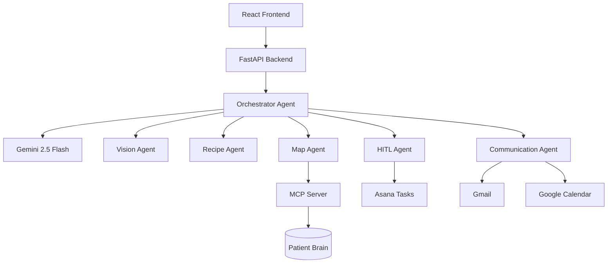
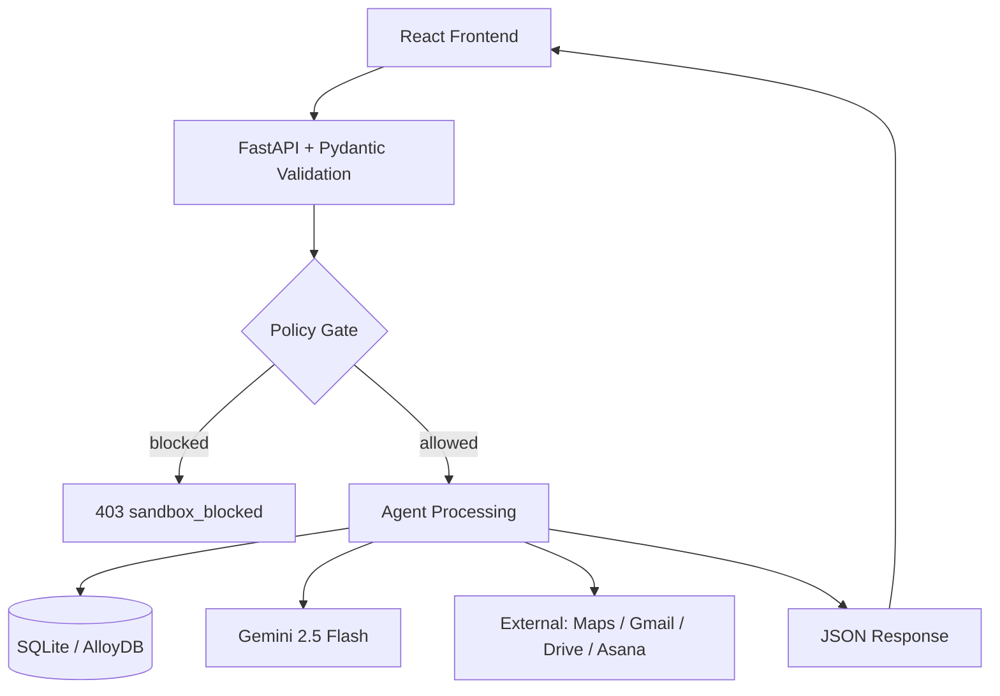

# CareSync — AI-Powered Chronic Care Management Agent

> **Track: Concierge Agents** | Kaggle 5-Day AI Agents: Intensive Vibe Coding Course with Google

[](https://youtu.be/JFzlHyiVQJA)
[](https://github.com/Mussliadii/CareSync)

**CareSync** is a multi-agent healthcare platform that helps patients with chronic conditions manage their daily care — from medication safety checks and prescription analysis to doctor handoffs and personalized nutrition — through intelligent, conversational AI.

---

## The Problem

Over 60% of adults worldwide live with at least one chronic condition (diabetes, epilepsy, eczema, hypertension). Managing these conditions is complex:

- **Multiple medications** with dangerous interaction risks
- **Fragmented care** — patients forget to share context between appointments
- **Zero proactive monitoring** — systems only react, never prevent
- **No intelligent triage** — patients can't quickly know when to escalate to a doctor

Existing health apps are passive trackers. CareSync is an **active agent** that reasons, acts, and coordinates care on your behalf.

---

## The Solution

CareSync is a **multi-agent chronic care copilot** built on Google ADK, FastAPI, and Gemini 2.5 Flash. It coordinates care across multiple dimensions simultaneously:

- **Conversational AI** — Chat or voice with a medically-grounded assistant that knows your conditions and prescriptions
- **Drug Safety Agent** — Real-time medication interaction checks powered by OpenFDA + Gemini reasoning
- **Vision Agent** — Upload prescription photos or symptom images for instant AI analysis (OCR + classification)
- **HITL Escalation** — Seamless human-in-the-loop handoff to doctors when needed, with Asana task routing
- **Recipe Studio** — Condition-aware nutrition guidance tailored to your specific chronic conditions
- **Map Agent** — Find nearby pharmacies, clinics, and hospitals via MCP-connected Google Maps
- **Google Workspace Integration** — Calendar appointments, Gmail summaries, Drive document storage

---

## Course Concepts Demonstrated

| Concept | Where | How |
|---------|-------|-----|
| **Multi-Agent System (ADK)** | `src/caresync/adk/` | Root orchestrator delegates to Vision, Recipe, Map, Questioner, Communication, and Data Fetcher sub-agents via Agent-to-Agent (A2A) protocol |
| **MCP Server** | `src/caresync/mcp/server.py` | Standardized tool access layer for database reads/writes and Google Maps — agents never touch data directly |
| **Security Features** | `src/caresync/app.py` | API key middleware, Pydantic request validation, execution policy gate (sandbox_blocked), scoped OAuth for Workspace APIs |
| **Agent Skills** | `src/caresync/agents/` | Specialist agents with grounded prompts: Orchestrator, HITL, Diet, Documents, Formulary, Routine, Communications |
| **Deployability** | `Dockerfile`, `cloudbuild.yaml` | Containerized via Docker, deployable to Google Cloud Run with automated build pipeline |

---

## Architecture

### High-Level Flow

```
User (Chat / Voice / Upload)
        │
        ▼
  React Frontend (Vite + TypeScript)
        │
        ▼
  FastAPI Backend (/orchestration/*)
        │
        ▼
  Orchestrator Agent (Google ADK)
   ├── Gemini 2.5 Flash (reasoning)
   ├── Vision Agent → prescription/symptom analysis
   ├── Recipe Agent → condition-aware nutrition
   ├── Map Agent → MCP → Google Maps
   ├── HITL Agent → Asana → Doctor
   ├── Communication Agent → Gmail / Calendar
   └── Data Fetcher Agent → OpenFDA / Wikipedia
        │
        ▼
  MCP Server (tool boundary)
        │
        ▼
  Patient Brain (SQLite / AlloyDB)
```

### Multi-Agent Orchestration (ADK)



### Data Flow



### Agent Roster

| Agent | Responsibility |
|-------|---------------|
| `Orchestrator` | Intent routing — decides which specialist agent to invoke |
| `Vision Agent` | Multimodal prescription scan and symptom image classification |
| `Recipe Agent` | Condition-aware recipe generation from AlloyDB |
| `Map Agent` | Nearby pharmacy / clinic search via MCP + Google Maps |
| `HITL Agent` | Doctor escalation — creates Asana task, drafts Gmail summary |
| `Communication Agent` | Gmail + Calendar integration for care coordination |
| `Data Fetcher Agent` | OpenFDA drug data, Wikipedia medical grounding |
| `Questioner Agent` | Structured intake and follow-up questioning |
| `Formulary Agent` | Medication formulary and drug safety checks |
| `Routine Agent` | Daily check-ins and medication reminder scheduling |

---

## Demo Story — Mus's Care Journey

Mus is a 22-year-old patient managing two chronic conditions:
- **Atopic Eczema** (moderate to severe) — recurring flares, managed with topical Clobetasol Propionate
- **Focal Epilepsy** — diagnosed at age 19, controlled with Levetiracetam 500 mg twice daily

The demo walks through:
1. Drug interaction check between Mus's two medications
2. Prescription image upload → OCR → medication extraction
3. Doctor escalation (HITL) via Asana + Gmail summary
4. Condition-aware recipe suggestions from the Recipe Studio
5. Finding the nearest pharmacy via the Map Agent

---

## Quick Start (Local, Free Tier)

### Prerequisites
- Python 3.10+
- Node.js 18+
- Google AI Studio API key (free at [aistudio.google.com](https://aistudio.google.com))

### 1. Backend Setup

```powershell
# Clone and enter project
git clone https://github.com/Mussliadii/CareSync.git
cd CareSync

# Create virtual environment
python -m venv .venv
.\.venv\Scripts\Activate.ps1

# Install dependencies
pip install -e .[dev]

# Configure environment
copy .env.example .env
# Edit .env — add your GOOGLE_API_KEY from aistudio.google.com

# Seed demo database
python -m caresync.scripts.seed

# Start backend
uvicorn caresync.app:app --reload
# → http://localhost:8000/docs
```

### 2. Frontend Setup

```powershell
cd frontend
npm install
npm run dev
# → http://localhost:3000
```

### 3. Free Tier Configuration

For running entirely free, set these in `.env`:

```env
DATABASE_URL=sqlite:///./caresync.db   # default — no cloud DB needed
USE_SYNTHETIC_MAPS=true                # skip Google Maps billing
GOOGLE_API_KEY=your_key_from_aistudio  # free tier sufficient
ADK_MODEL=gemini-2.5-flash             # best free-tier model
```

---

## Tech Stack

### Core
| Layer | Technology |
|-------|-----------|
| Backend | FastAPI, SQLAlchemy, Pydantic |
| Database | SQLite (local) / AlloyDB (production) |
| Frontend | React 19, Vite, TypeScript, Framer Motion |
| State | Zustand |

### AI & Agents
| Component | Technology |
|-----------|-----------|
| Primary LLM | Gemini 2.5 Flash |
| Agent Framework | Google ADK (Agent Development Kit) |
| Tool Protocol | MCP (Model Context Protocol) |
| Vision | Gemini Vision (multimodal) |
| TTS | Gemini 2.5 Flash Preview TTS |

### Integrations
- Google Drive, Calendar, Gmail, Speech-to-Text
- Google Maps (via MCP toolset)
- Asana (HITL doctor tasking)
- OpenFDA (drug safety data)
- BigQuery (analytics, optional)

---

## Directory Structure

```
CareSync/
├── adk_agents/              # ADK agent packages (standalone)
│   └── caresync_agent/
├── docs/                    # Architecture, design, agent diagrams
│   └── Agent_Digrams/       # Per-agent sequence diagrams
├── frontend/                # React + Vite SPA
│   └── src/
│       ├── components/      # Chat, Voice, UI blocks
│       ├── screens/         # Dashboard, CareMaze, MedHub, Doctor
│       └── lib/api.ts       # API transport layer
├── src/
│   └── caresync/
│       ├── adapters/        # External service connectors
│       ├── adk/             # ADK sub-agents (Vision, Recipe, Map...)
│       ├── agents/          # Specialist Python agents
│       ├── api/             # FastAPI routes + Pydantic models
│       ├── db/              # SQLAlchemy models + bootstrap
│       ├── mcp/             # MCP server (tool access layer)
│       ├── services/        # Business logic + model routing
│       └── app.py           # FastAPI entrypoint
├── Datasets/                # Clinical drug interaction datasets
├── tests/                   # Unit + integration tests
├── Dockerfile               # Backend container
├── frontend.Dockerfile      # Frontend nginx container
├── cloudbuild.yaml          # Cloud Run CI/CD pipeline
└── pyproject.toml
```

---

## Security Design

- **API Key Middleware** — all mutating requests require `x-api-key` header in production
- **Pydantic Validation** — strict typed contracts on every request boundary
- **Execution Policy Gate** — `sandbox_blocked` (403) for unauthorized operations
- **Scoped OAuth** — Google Workspace tokens are per-service (Drive, Calendar, Gmail separately)
- **No PII forwarded** to Maps or external services
- **`.env` excluded** from version control via `.gitignore`

---

## Results & Metrics

See [docs/results_and_metrics.md](docs/results_and_metrics.md) for:
- OCR accuracy benchmarks on prescription scans
- Agent response latency measurements
- AlloyDB query performance on 176,000+ clinical records
- Model comparison (Gemini Vision vs. MedSigLIP)

---

## Datasets

- [Indian Medicine Sample (100 drugs)](Datasets/Indian_medicine_sample_100.csv)
- [Drug-Drug Interaction Mappings](Datasets/drug_interactions.csv)

---

## Cloud Deployment (Optional)

```powershell
# Build and deploy backend to Cloud Run
gcloud builds submit --config cloudbuild.yaml

# Build and deploy frontend
gcloud builds submit --config cloudbuild.frontend.yaml
```

See [docs/CLOUD_RUN_DEPLOYMENT.md](docs/CLOUD_RUN_DEPLOYMENT.md) for full deployment guide.

---

## License

[MIT](LICENSE)
