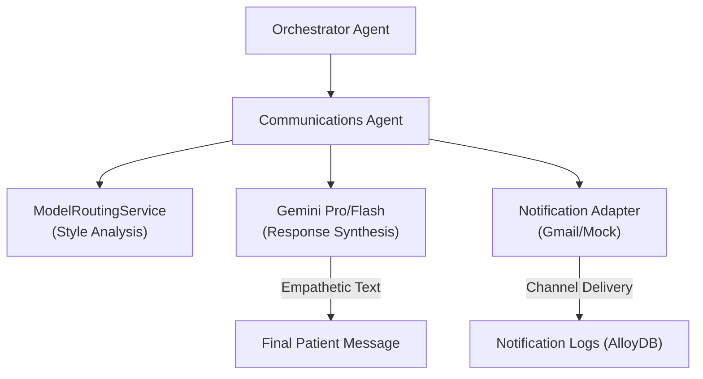

# Communications Agent – Empathetic Interaction & Notification Delivery

> **Document**: `CareSync/docs/communications_agent.md`
> **Last updated**: 2026-05-01

---

## Goal

The **Communications Agent** is the "voice" and "ears" of the CareSync platform. Its primary goal is to translate complex clinical data, agent findings, and system alerts into empathetic, concise, and patient-friendly language. It also manages the multi-channel notification system (Gmail, SMS, App) to ensure timely delivery of care updates.

---

## Architecture Diagram



---

## Core Responsibilities

1. **Daily Check-in Synthesis**: Automatically composes personalized "good morning" messages based on the patient's condition and daily routine tasks.
2. **Empathetic Response Generation**: Uses Gemini to refine orchestrator findings into 1-2 sentence, friendly responses.
3. **Multi-Channel Notifications**:
   - **Gmail**: Sends professional care summaries to doctors.
   - **App/SMS**: Sends quick reminders and status updates to patients.
4. **Notification Tracking**: Maintains a complete audit trail of all messages sent, including delivery status (sent, failed, pending).

---

## Agent Logic: `compose_daily_checkin`

The agent follows a strict template for daily engagement:
- **Greeting**: Personalizes by patient name.
- **Condition Context**: Acknowledges active conditions (e.g., "I'm keeping an eye on your IBS").
- **Task Focus**: Highlights the top 3 pending routine tasks for the day.
- **Call to Action**: Encourages the patient to share how they feel.

---

## Agent Schema

```python
class NotifyRequest(BaseModel):
    patient_id: int
    channel: str = "gmail"
    message_type: str = "alert"
    message_body: str

class ConversationRoutingResponse(BaseModel):
    message: str  # The synthesized, empathetic response
    route_type: str
    primary_model: str
    suggested_response_style: str = "calm, reassuring"
```

---

## Validation & Implementation Status

- [x] **Empathetic Prompting**: Verified that system instructions enforce concise, 1-2 sentence conversational styles.
- [x] **Patient Personalization**: Verified that `build_conversation_plan` correctly injects patient name and summary into the LLM context.
- [x] **Notification Logging**: Verified that every `notify` call creates a record in the `Notification` table in AlloyDB.
- [x] **Model Fallback**: Verified that `_generate_gemini_text` iterates through a candidate list of models if the primary model fails.
- [x] **HTML Safety**: Verified that `_build_professional_care_email` uses proper escaping to prevent script injection in doctor emails.

---

## Testing Checklist

- [ ] `adk web src` → `caresync_communication_agent` appears in dropdown
- [ ] Send query "I'm feeling anxious" → Confirm response is reassuring and concise
- [ ] Trigger notification via API → Confirm entry appears in `Patient Workspace` notifications tab
- [ ] Verify `compose_daily_checkin` correctly handles cases with 0 conditions (falls back to "your care plan")
- [ ] Test model fallback by temporarily disabling the primary Gemini API key
- [ ] Confirm `delivery_status` correctly transitions from `pending` to `sent` in the database
