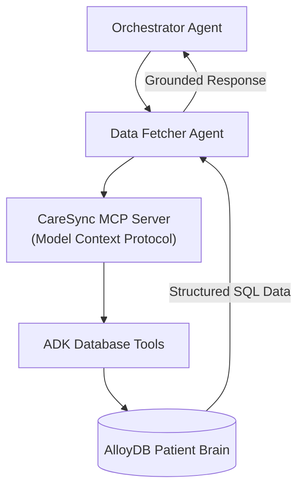

# Data Fetcher Agent – Grounded AlloyDB Retrieval & MCP Protocol

> **Document**: `CareSync/docs/data_fetcher_agent.md`
> **Last updated**: 2026-05-01

---

## Goal

The **Data Fetcher Agent** provides the "grounding" layer for all AI interactions within CareSync. Its primary goal is to retrieve structured facts from the **AlloyDB Patient Brain** (profiles, conditions, prescriptions) and serve them to other agents or the user with high fidelity. It ensures that the platform's reasoning is based on real clinical records, not LLM hallucinations.

---

## Architecture Diagram



---

## Core Capabilities

1. **Patient Profile Lookup**: Retrieves demographics, summary, and primary contact information.
2. **Clinical Context Retrieval**: Fetches active chronic conditions and recently scanned prescriptions.
3. **Medicine Fact Grounding**: Provides specific safety data for medications (focused on the Indian pharmaceutical market).
4. **Historical Snapshot Retrieval**: Pulls past condition snapshots to help specialists understand the trajectory of a patient's health.
5. **Infrastructure Health Monitoring**: Provides a `brain_healthcheck` tool to verify live connectivity between the AI layer and the database.

---

## Technical Implementation: MCP

The Data Fetcher Agent is a pure **MCP-enabled agent**. It communicates with a local or remote MCP server that has direct SQL access:

- **Protocol**: Model Context Protocol (MCP) via Stdio.
- **Server Command**: Dynamically resolved via `sys.executable` or configuration.
- **Toolset**: `McpToolset` exposes tools like `brain_get_patient_profile` and `brain_get_relevant_conditions`.
- **Environment**: Inherits system environment variables to manage database connection strings securely.

---

## Agent Schema

```python
class MedicineGroundedAnswerRequest(BaseModel):
    patient_id: int
    medication_name: str

class MedicineGroundedAnswerResponse(BaseModel):
    patient_id: int
    medication_name: str
    safety_summary: str
    source_used: str
    wiki_link: str | None = None
```

---

## Validation & Implementation Status

- [x] **MCP Server Spawning**: Verified that the agent correctly initializes the MCP server using the configured Python interpreter and arguments.
- [x] **Relational Accuracy**: Verified that the `brain_get_relevant_conditions` tool returns exactly what is stored in the `ChronicCondition` table.
- [x] **Fact Preservation**: Verified that the agent follows the "Never invent medical facts" instruction by returning "Data unavailable" for missing records.
- [x] **A2A Grounding**: Verified that the Orchestrator uses the Data Fetcher Agent to populate context for the Recipe and Map agents.
- [x] **Tool Metadata**: Verified that all MCP tools have clear, descriptive docstrings that Gemini uses for tool selection.

---

## Testing Checklist

- [ ] `adk web src` → `caresync_data_fetcher_agent` appears in dropdown
- [ ] Submit query "What are my current medications?" → Confirm list matches AlloyDB `Prescription` table
- [ ] Verify `brain_healthcheck` tool returns a "healthy" status in the agent logs
- [ ] Test agent response for a non-existent patient ID (should return a clear "not found" message)
- [ ] Confirm that `source_used` in the response explicitly mentions "AlloyDB" or "Patient Profile"
- [ ] Verify that the agent correctly handles multi-word medication names (e.g., "Metformin Hydrochloride")
