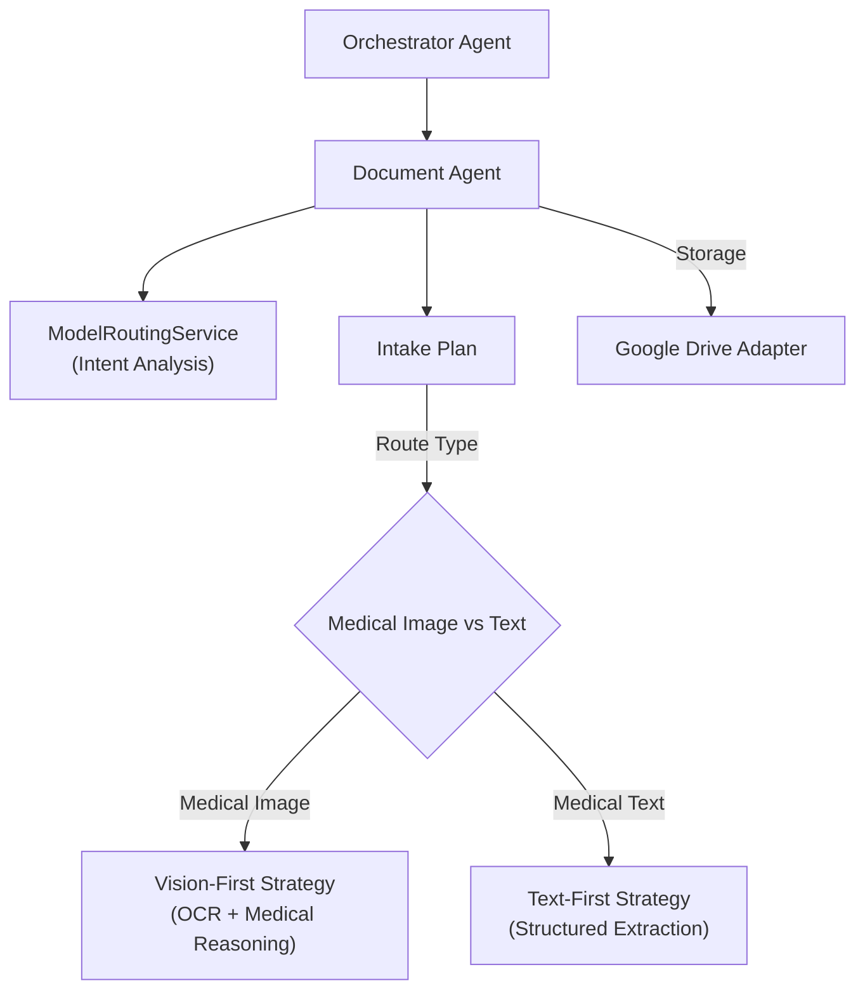

# Document Agent – Medical Input Routing & Ingestion Pipeline

> **Document**: `CareSync/docs/document_agent.md`
> **Last updated**: 2026-05-01

---

## Goal

The **Document Agent** is responsible for the complex routing and planning required to ingest medical documents (prescriptions, lab reports, symptom photos). It analyzes file metadata and raw text hints to determine the most effective OCR and reasoning strategy, ensuring that each document is processed by the optimal AI model (e.g., MedSigLIP for vision or Gemini for structured reasoning).

---

## Architecture Diagram



---

## Core Responsibilities

1. **Intake Planning**: Generates a detailed `execution_plan` for every uploaded document, specifying which models will handle OCR and clinical reasoning.
2. **Model Selection**: Automatically selects the primary and support models based on `ModelRoutingService` logic (e.g., routing a blurry image to a vision-optimized model).
3. **Strategy Definition**:
    - **Vision-First**: Used for images with minimal text context.
    - **Text-First**: Used for digital PDFs or high-contrast scans with existing OCR data.
4. **Metadata Management**: Resolves file paths and names to ensure documents are stored correctly in the patient's hierarchical Drive folder.

---

## Intake Plan: `build_document_intake_plan`

The agent produces a "Recipe for Ingestion":
- **`ocr_model`**: The model responsible for pixel-to-text conversion.
- **`reasoning_model`**: The model that interprets the text (e.g., mapping "TID" to "Three times a day").
- **`storage_target`**: Currently standardized to `google_drive`.
- **`ocr_strategy`**: Directs downstream services on how to sequence the processing.

---

## Agent Schema

```python
class DocumentPipelineRequest(BaseModel):
    patient_id: int
    file_path: str
    raw_text_hint: str | None = None
    prescription_id: int | None = None

class DocumentPipelineResponse(BaseModel):
    file_name: str
    ocr_model: str
    reasoning_model: str
    ocr_strategy: str
    route_type: str
    execution_plan: list[str]
```

---

## Validation & Implementation Status

- [x] **Routing Precision**: Verified that `ModelRoutingService` correctly identifies medical images vs. general documents.
- [x] **Path Resolution**: Verified that `Path(file_path).name` correctly extracts filenames for storage metadata.
- [x] **Default Model Fallback**: Verified that the agent defaults to `gemini_fast_model_id` if the router doesn't specify a secondary model.
- [x] **Execution Transparency**: Verified that the `route_reason` and `execution_plan` strings are passed through for frontend transparency.
- [x] **AlloyDB Linkage**: Verified that the `prescription_id` is preserved throughout the pipeline for eventual database updates.

---

## Testing Checklist

- [ ] `adk web src` → Document pipeline flow is visible
- [ ] Upload a `.jpg` prescription → Confirm `ocr_strategy` is "vision_first"
- [ ] Upload a `.pdf` report → Confirm `ocr_strategy` is "text_first"
- [ ] Verify that `file_name` in the response matches the actual uploaded file
- [ ] Check if `reasoning_model` is correctly selected for complex symptom descriptions
- [ ] Confirm that `execution_plan` contains at least 2 steps for multi-stage processing
