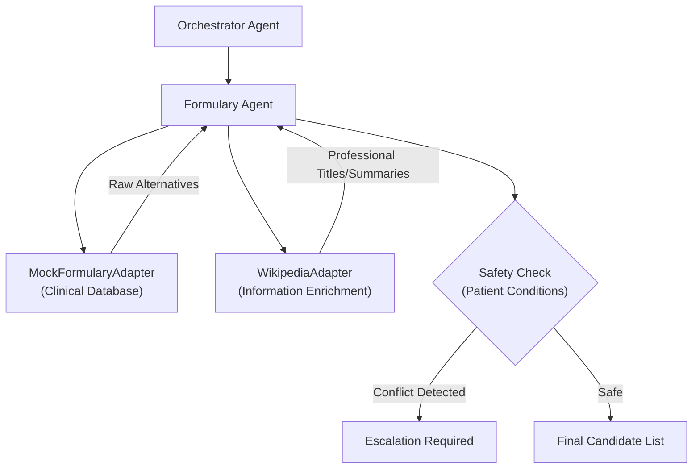

# Formulary Agent – Medication Alternatives & Safety Enrichment

> **Document**: `CareSync/docs/formulary_agent.md`
> **Last updated**: 2026-05-01

---

## Goal

The **Formulary Agent** assists patients and doctors when a specific medication is unavailable (e.g., out of stock at the pharmacy). Its goal is to identify clinically-equivalent alternatives (generics or different formulations) and cross-reference them with the patient's conditions to ensure safety. It enriches raw formulary data with professional context from sources like Wikipedia.

---

## Architecture Diagram



---

## Core Responsibilities

1. **Alternative Identification**: Finds generic or brand-name alternatives for a requested medication using the `MockFormularyAdapter`.
2. **Information Enrichment**: Queries Wikipedia to retrieve professional titles and summaries for drug candidates, improving the "Clinical Hub" UI experience.
3. **Condition-Aware Safety Check**:
   - Analyzes formulation notes (e.g., "Extended Release").
   - Cross-references with conditions (e.g., "Extended-release options may irritate active IBS").
   - Triggers a mandatory `escalation_required` flag if a potential conflict is found.
4. **Summary Synthesis**: Provides a concise summary of the safety findings (e.g., "No blocking safety issues" vs "Doctor review required").

---

## Safety Logic: `check_alternatives`

The agent applies specific rules during candidate evaluation:
- **Formulation Conflicts**: If a patient has **IBS** and a candidate is an **Extended-release** formulation, a caution note is added and the case is flagged for escalation.
- **Title Normalization**: If a high-quality Wikipedia entry is found, the drug's display name is updated to the professional Wikipedia title for better recognition.

---

## Agent Schema

```python
class AlternativeCandidate(BaseModel):
    name: str
    formulation_note: str
    safety_note: str = "No known issue from demo context."

class CheckAlternativesResponse(BaseModel):
    candidates: list[AlternativeCandidate]
    escalation_required: bool
    summary: str
```

---

## Validation & Implementation Status

- [x] **Enrichment Logic**: Verified that Wikipedia titles are correctly mapped to candidate names when a match is found.
- [x] **Escalation Triggers**: Verified that "IBS + Extended-release" correctly sets `escalation_required=True`.
- [x] **Search Robustness**: Verified that searches are case-insensitive to ensure reliable drug matching.
- [x] **Adapter Independence**: Verified that the agent can function even if Wikipedia enrichment fails (falls back to raw formulary name).
- [x] **Pydantic Compatibility**: Verified that all candidates correctly serialize into the `AlternativeCandidate` model.

---

## Testing Checklist

- [ ] `adk web src` → Medication alternative flow is visible in the Medication Hub
- [ ] Search alternatives for "Metformin" for an IBS patient → Confirm "Extended-release" caution is present
- [ ] Search for a medication with a known Wikipedia entry → Confirm the title is professionally formatted
- [ ] Verify `escalation_required` is `false` for standard generic substitutions without condition conflicts
- [ ] Confirm `summary` accurately reflects the safety state (Safe vs Escalation)
- [ ] Test agent response when `MockFormularyAdapter` returns an empty list (should return empty candidates with no error)
