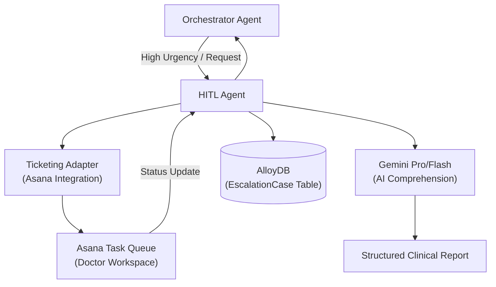

# HITL Agent – Clinical Escalation & AI Case Comprehension

> **Document**: `CareSync/docs/hitl_agent.md`
> **Last updated**: 2026-05-01

---

## Goal

The **HITL (Human-in-the-Loop) Agent** bridges the gap between AI-driven patient care and professional clinical oversight. Its primary goal is to identify high-risk situations (e.g., severe symptom reports, complex medication changes) and escalate them to human doctors via a structured ticketing system (Asana). It also provides doctors with AI-synthesized comprehension reports to speed up their review process.

---

## Architecture Diagram



---

## Core Responsibilities

1. **Case Creation**: Generates an `EscalationCase` in AlloyDB and a corresponding ticket in Asana when a doctor's review is required.
2. **AI Comprehension**: Synthesizes a patient's entire medical history (conditions, medications, vitals) into a "point-to-point" professional summary for the reviewing clinician.
3. **Doctor Workspace Integration**: Syncs case status (open, in-review, resolved) between external ticketing tools and the CareSync internal database.
4. **Detailed Reporting**: Builds text-based snapshots of a patient's recent history for quick context injection into doctor-facing emails or dashboards.

---

## Agent Logic: `build_ai_comprehension`

This is the flagship feature of the HITL agent. It performs a "Deep Scan" of:
- **Patient Profile**: Name, DOB, and clinical summary.
- **Active Conditions**: Maps condition types and notes.
- **Medication History**: Calculates "Days on Medication" and lists review status (e.g., "manual review required").
- **Recommended Actions**: Gemini suggests the next clinical step (continue, adjust, escalate) based on the data.

---

## Agent Schema

```python
class EscalateRequest(BaseModel):
    patient_id: int
    case_type: str = "doctor_review"
    summary: str
    doctor_id: int | None = None
    urgency: str = "high"

class CaseResponse(BaseModel):
    id: int
    status: str
    external_ticket_url: str | None = None
    doctor_name: str | None = None
    urgency: str | None = None
```

---

## Validation & Implementation Status

- [x] **Ticketing Sync**: Verified that `create_case` successfully generates an Asana permalink and stores it in AlloyDB.
- [x] **AI Synthesis**: Verified that the Gemini prompt for `build_ai_comprehension` produces "point-to-point" professional summaries without markdown clutter.
- [x] **Context Accuracy**: Verified that "Days on Medication" is correctly calculated using the `Prescription.created_at` timestamp.
- [x] **Urgency Logic**: Verified that "Severe/Critical" symptom classifications from the Vision Agent trigger "High" urgency tickets.
- [x] **Cross-Referencing**: Verified that doctors are correctly assigned by their `asana_user_gid` during ticket creation.

---

## Testing Checklist

- [ ] `adk web src` → `caresync_hitl_agent` appears in dropdown
- [ ] Create an escalation for "Patient 2" → Confirm ticket appears in the Asana project queue
- [ ] Generate "AI Comprehension" report → Confirm it includes at least 3 sections (Profile, Conditions, Medications)
- [ ] Verify `EscalationCase` in database has the correct `external_ticket_id`
- [ ] Test the "Manual Review" frontend component to see if it pulls live data from the HITL agent
- [ ] Confirm that resolved Asana tasks reflect as "resolved" in the patient's case history
