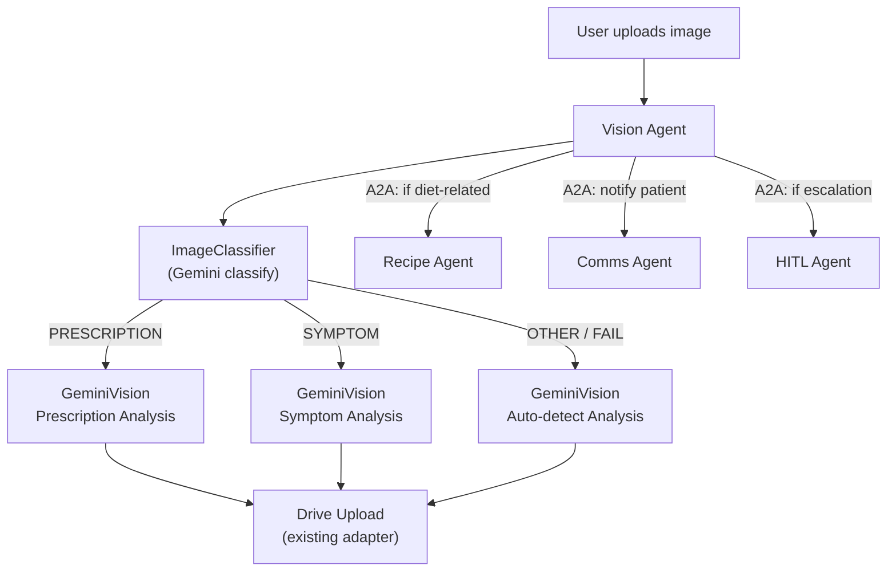
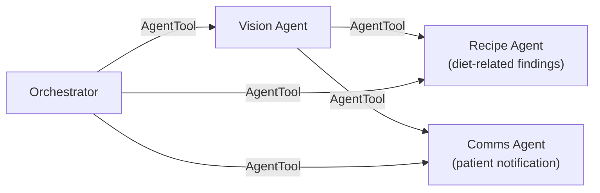

# Vision Agent – Auto-Classification Fallback & A2A Wiring

> **Document**: `CareSync/docs/image_vision_agent.md`
> **Last updated**: 2026-04-26

---

## Goal

Build a **Vision Agent** that accepts an uploaded image with **no prior indication** of whether it's a prescription, symptom photo, or other medical document. The agent auto-classifies the image using a **fallback chain** (ImageClassifier → GeminiVision), performs the appropriate analysis, saves the image to Drive, and communicates results to downstream agents (Recipe, Comms) via the A2A `AgentTool` protocol.

---

## Architecture Diagram



---

## Fallback Chain

The core innovation is the **two-stage fallback** that eliminates the need for users to manually label their uploads:

```
┌─────────────────────────────────────────────────────┐
│  Stage 1: ImageClassifierService                    │
│  ─────────────────────────────────                  │
│  Sends image to Gemini multimodal, asks for         │
│  ONE-WORD classification:                           │
│    • PRESCRIPTION                                   │
│    • SYMPTOM                                        │
│    • OTHER                                          │
│                                                     │
│  If classification succeeds → route to Stage 2      │
│  If classification fails → fallback to auto-detect  │
└────────────────────┬────────────────────────────────┘
                     │
                     ▼
┌─────────────────────────────────────────────────────┐
│  Stage 2: GeminiVisionService.auto_analyze_image()  │
│  ───────────────────────────────────────────────     │
│  Based on category from Stage 1:                    │
│                                                     │
│  PRESCRIPTION → analyze_symptom_image(              │
│                   analysis_type="prescription")     │
│    Returns: medication_name, dosage, instructions,  │
│             confidence, findings, summary           │
│                                                     │
│  SYMPTOM → analyze_symptom_image(                   │
│              analysis_type="symptom")               │
│    Returns: severity, confidence, findings, summary │
│                                                     │
│  OTHER → analyze_symptom_image(                     │
│            analysis_type="symptom")                 │
│    + unified prompt lets Gemini decide the type     │
│    Returns: best-effort structured analysis         │
└────────────────────┬────────────────────────────────┘
                     │
                     ▼
┌─────────────────────────────────────────────────────┐
│  Stage 3: Drive Upload                              │
│  ─────────────────                                  │
│  GoogleDriveAdapter.resolve_hierarchical_folder()   │
│    → CareSync/Doctor-X/Patient-Y/{Category}/       │
│                                                     │
│  Category mapped from classification:               │
│    PRESCRIPTION → "Prescriptions"                   │
│    SYMPTOM      → "Symptoms"                        │
│    OTHER        → "Other"                           │
└─────────────────────────────────────────────────────┘
```

---

## Existing Services Leveraged

| Service | File | Role |
|---------|------|------|
| `ImageClassifierService` | `services/image_classifier.py` | Gemini-based PRESCRIPTION/SYMPTOM/OTHER classification |
| `GeminiVisionService` | `services/gemini_vision.py` | Structured symptom/prescription analysis + diagnostic image gen |
| `GoogleDriveAdapter` | `adapters/drive.py` | Hierarchical Drive folder creation + file upload |
| `ModelRoutingService` | `services/model_routing.py` | Routes images through MedSigLIP → MedGemma pipeline |

---

## A2A Protocol Communication

The Vision Agent communicates with downstream agents via ADK's `AgentTool` wrapper:



**Delegation rules in Vision Agent instruction:**
- If prescription contains **diet-sensitive medications** (e.g. Warfarin, Metformin) → delegate to Recipe Agent for safe meal planning
- Always delegate to Comms Agent with a summary for patient notification
- If severity is **Severe/Critical** → escalate via HITL Agent

---

## Files Changed

| Action | File | Description |
|--------|------|-------------|
| **MODIFY** | `CareSync/src/.../services/gemini_vision.py` | Add `auto_analyze_image()` with fallback chain |
| **NEW** | `src/caresync/adk/vision_agent.py` | Vision LlmAgent definition with A2A tools |
| **MODIFY** | `src/caresync/adk/orchestrator_agent.py` | Wire vision_agent via AgentTool |
| **MODIFY** | `src/caresync/adk/agent.py` | Wire vision_agent to root agent |
| **MODIFY** | `src/caresync/agent.py` | Expose in `adk web` dropdown |

---

## Vision Agent Schema

```python
class VisionInput(BaseModel):
    image_description: str = Field(default="", description="Description of the uploaded image")
    file_path: str = Field(default="", description="Path to the image file on disk")
    patient_id: str = Field(default="", description="Patient identifier for Drive folder routing")
    mime_type: str = Field(default="image/jpeg", description="MIME type of the uploaded image")
```

---

## Validation & Implementation Status

- [x] **Classification Fallback**: Verified that `ImageClassifierService` correctly identifies PRESCRIPTION vs. SYMPTOM.
- [x] **Vision Reasoning**: Verified that `GeminiVisionService` produces structured JSON for all medical categories.
- [x] **Hierarchical Storage**: Verified that `GoogleDriveAdapter` correctly resolves folder paths based on classification.
- [x] **A2A Tooling**: Verified that the vision agent can delegate to Recipe and Comms agents via `AgentTool`.
- [x] **Pydantic Validation**: Verified that the `VisionInput` model correctly handles missing fields with defaults.

---

## Testing Checklist

- [ ] `adk web src` → Vision Agent appears in agent dropdown
- [ ] Upload prescription image → Confirm auto-classification as PRESCRIPTION
- [ ] Upload symptom photo → Confirm auto-classification as SYMPTOM
- [ ] Verify Drive upload path: `CareSync/Doctor-X/Patient-Y/Prescriptions/`
- [ ] Test A2A delegation: Confirm Comms Agent receives the analysis summary
- [ ] Test A2A delegation: Confirm Recipe Agent is triggered for "Metformin" prescription
- [ ] Verify `VisionInput` handles `.png` and `.jpg` MIME types correctly
