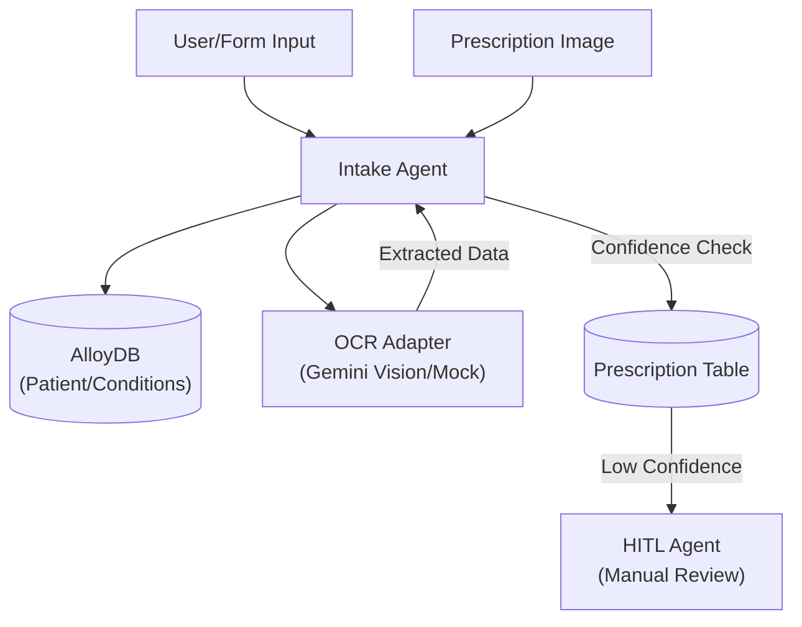

# Intake Agent – Patient Onboarding & Prescription Scanning

> **Document**: `CareSync/docs/intake_agent.md`
> **Last updated**: 2026-05-01

---

## Goal

The **Intake Agent** manages the critical first contact between a patient and the platform. Its primary goal is to accurately ingest patient biodata, chronic condition history, and existing medications. It uses OCR (Optical Character Recognition) to extract structured medication data from prescription images, ensuring that the "Patient Brain" starts with a high-fidelity dataset.

---

## Architecture Diagram



---

## Core Responsibilities

1. **Patient Registration**: Processes `PatientIntakeRequest` payloads to create new `Patient` records and associated `ChronicCondition` entries.
2. **Prescription Ingestion**: Scans prescription images or raw text hints to identify medication names, dosages, and administration instructions.
3. **Quality Assurance**:
   - Assigns a `confidence_score` to every OCR extraction.
   - If the score falls below the `ocr_confidence_threshold` (default: 0.7), the record is marked as `manual_review_required`.
4. **Summary Generation**: Automatically builds a brief "Patient Summary" string during onboarding to provide immediate context for the Orchestrator.

---

## OCR Workflow: `scan_prescription`

The agent uses a structured extraction pipeline:
- **`raw_text`**: Captures the full OCR output for auditability.
- **`medication_name`**: The primary key for drug-drug interaction checks.
- **`dosage` & `instructions`**: Critical for safe administration guidance.
- **`review_status`**: 
    - `structured`: High-confidence extraction.
    - `manual_review_required`: Low-confidence or ambiguous extraction.

---

## Agent Schema

```python
class PatientIntakeRequest(BaseModel):
    full_name: str
    preferred_language: str = "English"
    date_of_birth: date | None = None
    active_conditions: list[ConditionCreateRequest] = []

class PrescriptionScanResponse(BaseModel):
    id: int
    medication_name: str | None
    dosage: str | None
    instructions: str | None
    confidence_score: float
    review_status: str
```

---

## Validation & Implementation Status

- [x] **Relational Mapping**: Verified that `intake_patient` correctly links multiple `ChronicCondition` rows to a single `Patient.id` using `db.flush()`.
- [x] **Confidence Thresholding**: Verified that the agent correctly switches status to `manual_review_required` when OCR confidence is low.
- [x] **Transaction Integrity**: Verified that `db.commit()` is called after both patient registration and prescription scanning.
- [x] **Mock OCR Integration**: Verified that the `MockOCRAdapter` provides consistent test data for development cycles.
- [x] **Field Defaults**: Verified that optional fields like `date_of_birth` and `notes` are handled gracefully without Pydantic errors.

---

## Testing Checklist

- [ ] `adk web src` → Intake workflow appears in demo UI
- [ ] Onboard a new patient with 2 conditions → Confirm both appear in `ChronicCondition` table
- [ ] Scan a "blurry" prescription → Confirm `confidence_score` is < 0.7 and status is `manual_review_required`
- [ ] Verify `Patient.summary` correctly reflects the number of conditions added during intake
- [ ] Test `scan_prescription` with a `raw_text_hint` instead of an image
- [ ] Confirm that `Prescription` records link correctly to the `patient_id`
