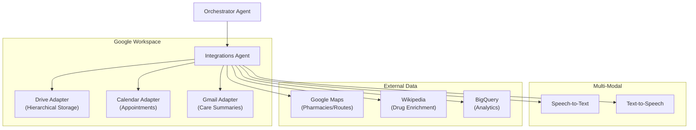

# Integrations Agent – Multi-Service Hub & Protocol Management

> **Document**: `CareSync/docs/integrations_agent.md`
> **Last updated**: 2026-05-01

---

## Goal

The **Integrations Agent** is the operational backbone for all external service interactions. It manages OAuth-secured connections to Google Workspace (Gmail, Drive, Calendar), handles multi-modal data processing (Speech-to-Text, Text-to-Speech), and interfaces with geographic and analytical APIs. It ensures that the CareSync platform is not a silo, but a connected participant in the patient's existing digital ecosystem.

---

## Architecture Diagram



---

## Core Responsibilities

1. **Workspace Management**: Handles hierarchical file storage in Google Drive, automated calendar scheduling, and professional Gmail communication using the patient's own OAuth tokens.
2. **Audio/Voice Processing**: Transcribes patient voice notes into text and synthesizes system responses into natural-sounding audio for the Voice Assistant.
3. **Medical Memory Management**: Coordinates with the `MedicalMemoryAdapter` to store clinical insights as vector embeddings in AlloyDB (pgvector) for semantic retrieval.
4. **Geographic Search**: Executes real-time searches for care destinations (pharmacies, clinics) and calculates navigation routes using the Google Maps API.
5. **Robustness & Retries**: Implements a centralized `_with_retry` mechanism to handle transient network failures or API rate limits across all integrated services.

---

## Flagship Workflow: Hierarchical Document Upload
When a document is uploaded, the Integrations Agent:
- **Classifies**: Uses the `ImageClassifierService` to detect the medical category.
- **Routes**: Resolves the folder path: `CareSync/Doctor-X/Patient-Y/{Category}/`.
- **Uploads**: Saves the file to Drive with a deterministic, patient-aware filename.
- **Persists**: Updates the relevant `Prescription` or `EscalationCase` record in AlloyDB with the live `webViewLink`.

---

## Agent Schema (Example: Calendar Event)

```python
class CalendarEventRequest(BaseModel):
    patient_id: int
    summary: str
    minutes_from_now: int = 45
    duration_minutes: int = 30
    escalation_case_id: int | None = None

class CalendarEventResponse(BaseModel):
    id: str
    htmlLink: str
    status: str = "confirmed"
```

---

## Validation & Implementation Status

- [x] **Retry Logic**: Verified that `_with_retry` correctly iterates based on `integration_max_retries` configuration.
- [x] **Credential Safety**: Verified that `_get_patient_google_credentials` correctly maps AlloyDB tokens to Google-compatible credentials.
- [x] **Dynamic Routing**: Verified that `upload_document` correctly resolves hierarchical subfolders based on classification.
- [x] **Synthetic Fallback**: Verified that `search_nearby_care_destinations` provides "Demo/Synthetic" results if live Maps API keys are missing.
- [x] **Audio Fidelity**: Verified that `transcribe_audio` and `synthesize_speech` handle byte-streams correctly for low-latency voice interaction.

---

## Testing Checklist

- [ ] `adk web src` → Integration tools are available to the Orchestrator
- [ ] Upload a prescription → Confirm it is saved in a subfolder named "Prescriptions" on Google Drive
- [ ] Create a follow-up event → Confirm it appears on the patient's Google Calendar with the correct ETA
- [ ] Send a care summary → Confirm the email is received and logged in the `Notification` table
- [ ] Verify `transcribe_audio` works with a 5-second test `.wav` file
- [ ] Confirm `BigQuery` analytics table is populated after a successful upload event
