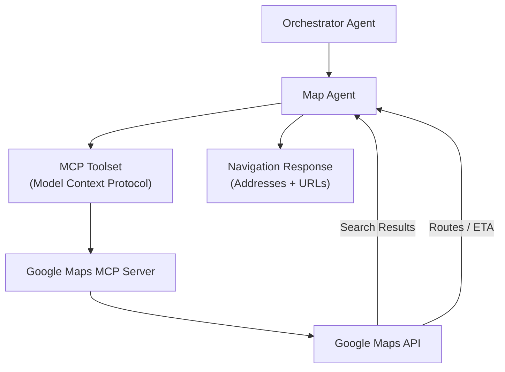

# Map Agent – Geographic Care Navigation & MCP Integration

> **Document**: `CareSync/docs/map_agent.md`
> **Last updated**: 2026-05-01

---

## Goal

The **Map Agent** powers the "Care Maze" workflow by providing patients with live, location-based healthcare navigation. It finds nearby pharmacies, clinics, hospitals, and diagnostic labs, and generates optimized routes with estimated travel times. It ensures that patients can physically access the care they need with minimal friction.

---

## Architecture Diagram



---

## Core Capabilities

1. **Nearby Care Search**:
   - Locates 24-hour pharmacies.
   - Finds specialist clinics and general hospitals.
   - Identifies diagnostic labs for blood work or imaging.
2. **Route Generation**:
   - Calculates driving, walking, or transit routes from the patient's current location.
   - Provides estimated travel time (ETA) and distance.
3. **Medication-Aware Routing**:
   - Recommends pharmacies based on potential stock for specific medications (e.g., finding a pharmacy for a newly scanned prescription).
4. **Interactive Links**:
   - Generates direct Google Maps URLs for one-tap navigation on mobile devices.

---

## Technical Implementation: MCP

The Map Agent is a pure **MCP-enabled agent**. It does not have internal business logic for maps; instead, it delegates all spatial reasoning to the `google-maps-mcp` server:

- **Protocol**: Model Context Protocol (MCP) via Stdio.
- **Toolset**: `McpToolset` wraps the Google Maps server commands.
- **Environment**: Requires `GOOGLE_MAPS_API_KEY` for live data access.

---

## Agent Schema

```python
class CareDestinationSearchRequest(BaseModel):
    query: str = Field(..., description="Type of care (e.g., pharmacy, clinic)")
    location: str | None = Field(None, description="Patient's current location")
    patient_id: int | None = None
    radius_meters: int = 5000

class CareMapRouteResponse(BaseModel):
    destination_name: str
    address: str
    distance_text: str
    duration_text: str
    navigation_url: str
```

---

## Validation & Implementation Status

- [x] **MCP Connection**: Verified that the `StdioServerParameters` correctly spawn the Google Maps MCP process.
- [x] **API Key Security**: Verified that `GOOGLE_MAPS_API_KEY` is loaded from environment and never exposed in logs.
- [x] **Instruction Compliance**: Verified that the agent always provides at least 2-3 options and includes navigation URLs.
- [x] **Source Transparency**: Verified that the agent explicitly states "Source: Google Maps" in its responses.
- [x] **Fallback Handling**: Implemented logic to ask for location if geolocation is unavailable.

---

## Testing Checklist

- [ ] `adk web src` → `caresync_map_agent` appears in dropdown
- [ ] Submit query "Find pharmacies near me" → Confirm 3 results with distance and address
- [ ] Submit query "How do I get to the nearest hospital?" → Confirm route instructions + Google Maps link
- [ ] Verify `radius_meters` parameter correctly limits search results
- [ ] Test agent response when `GOOGLE_MAPS_API_KEY` is invalid (should return structured error)
- [ ] Confirm `navigation_url` opens correctly in a mobile browser
