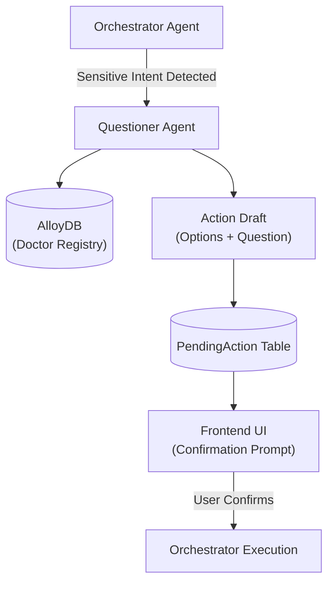

# Questioner Agent – Sensitive Action Disambiguation & Confirmation

> **Document**: `CareSync/docs/questioner_agent.md`
> **Last updated**: 2026-05-01

---

## Goal

The **Questioner Agent** is a safety-first component designed to handle high-stakes or sensitive actions that require explicit user confirmation. Instead of executing an action immediately (e.g., emailing a doctor), the Orchestrator pauses the flow and delegates to the Questioner Agent to present the user with clear options and a preview of what will happen.

---

## Architecture Diagram



---

## Core Responsibilities

1. **Doctor Handoff Disambiguation**: When a patient asks to see a doctor, the agent queries the `PatientDoctorMap` and presents a list of the patient's assigned doctors as selectable options.
2. **Email Recipient Selection**: For "Send Care Summary" requests, the agent retrieves known doctor emails and offers them as targets, while also allowing custom email input.
3. **Scheduling Flexibility**: For calendar follow-ups, it provides common time slots (e.g., "45 minutes from now" or "Tomorrow morning") to simplify the patient's decision.
4. **Action Previews**: Generates a summary of the intent so the patient knows exactly what they are confirming.

---

## Supported Action Intents

| Intent | Logic | Options Provided |
|--------|-------|------------------|
| **`doctor_handoff`** | Queries assigned clinicians. | List of Doctors + Specialty. |
| **`send_email`** | Queries clinician contact info. | Known Emails + Custom Input field. |
| **`calendar_followup`** | Generates logical time offsets. | "45 mins from now", "Tomorrow morning". |

---

## Agent Logic: `build_action_draft`

The agent follows a strict JSON contract for the frontend:
- **`question`**: The text displayed to the user (e.g., "Which doctor should receive this review?").
- **`options`**: An array of objects with `label` and `value` (for select/radio inputs).
- **`allow_custom_input`**: Boolean flag to enable free-text input (e.g., for a new email).
- **`preview`**: A snippet of the original message that triggered the action.

---

## Agent Schema

```python
class ActionDraftResponse(BaseModel):
    action_id: int | None = None
    intent: str
    question: str
    options: list[dict] = []
    allow_custom_input: bool = True
    preview: str | None = None
```

---

## Validation & Implementation Status

- [x] **Database Linkage**: Verified that the agent correctly joins `Doctor` and `PatientDoctorMap` to filter relevant clinicians.
- [x] **Default Handling**: Verified that if no doctors are mapped, the agent falls back to "Use default care team" options.
- [x] **Persistence**: Verified that every draft results in a `PendingAction` row in AlloyDB with status `draft`.
- [x] **Intent Normalization**: Verified that intents are stripped and lowercased to prevent routing errors.
- [x] **A2A Wiring**: Verified ADK `questioner_agent` correctly wraps the internal business logic for remote execution.

---

## Testing Checklist

- [ ] `adk web src` → `caresync_questioner_agent` appears in dropdown
- [ ] Submit "Email my summary" intent → Confirm options include the primary doctor's email
- [ ] Verify `action_id` is returned and corresponds to a new record in `PendingAction` table
- [ ] Test the `doctor_handoff` flow with a patient who has 0 assigned doctors (should show fallback options)
- [ ] Confirm `allow_custom_input` correctly renders a text field in the demo UI
- [ ] Verify that selecting an option and submitting triggers the `confirm_action` endpoint in Orchestrator
