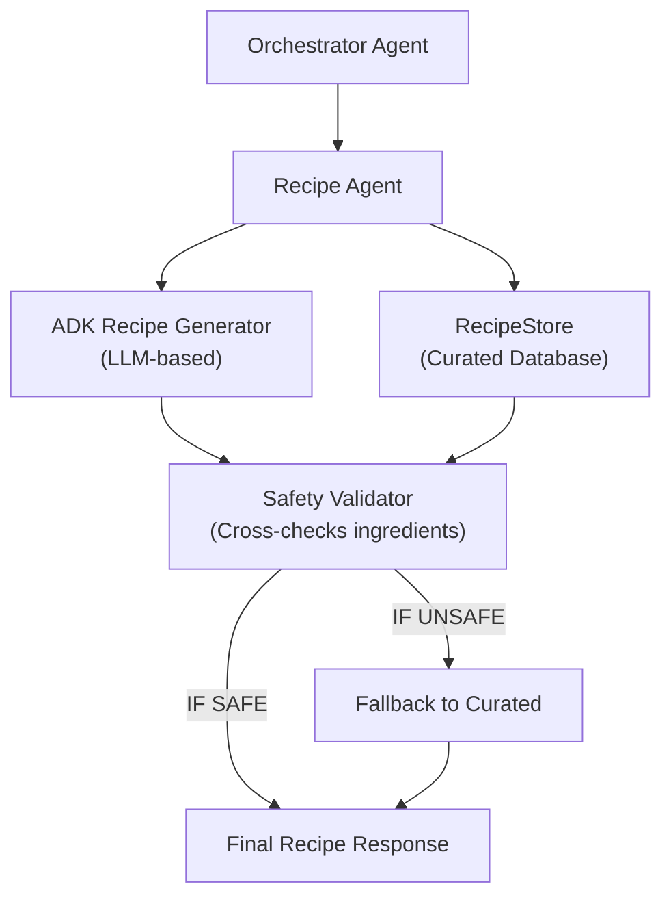

# Recipe Agent – Medication-Aware Meal Planning & Generation

> **Document**: `CareSync/docs/recipe_agent.md`
> **Last updated**: 2026-05-01

---

## Goal

The **Recipe Agent** (Diet Agent) provides clinically-safe nutritional guidance and personalized recipe suggestions. Its core mission is to ensure that meal planning aligns with a patient's active medications and chronic conditions, preventing dangerous interactions (e.g., grapefruit with statins) and optimizing for condition-specific needs (e.g., low-irritation foods for IBS).

---

## Architecture Diagram



---

## Safety Features

### 1. Medication Interaction Checks
- **Statins**: Automatically flags and blocks "Grapefruit" or "Grapefruit Juice".
- **Metformin**: Injects guidance to take medication with meals to minimize gastrointestinal distress.
- **Warfarin**: (Planned) Monitoring of Vitamin K intake consistency.

### 2. Condition-Specific Cautions
- **IBS (Irritable Bowel Syndrome)**: Scans for and flags spicy ingredients (chili, pepper) as "Caution" during flares.
- **Diabetes**: (Planned) Glycemic index filtering and portion control.

### 3. Fallback Mechanism
If the LLM-generated recipes fail validation (e.g., contain blocked ingredients or malformed JSON), the agent automatically falls back to a curated set of verified "gold standard" recipes from the `RecipeStore`.

---

## Agent Logic: `apply_safety_rules`

The agent uses a deterministic logic layer to post-process all recipes:
- **`avoid_flags`**: Explicitly lists ingredients that must be avoided.
- **`safety_notes`**: Provides human-readable context (e.g., "Use milder seasoning during IBS flares").
- **`why_it_fits`**: Explains the clinical rationale for the recommendation.

---

## Agent Schema

```python
class GenerateDietRecipesRequest(BaseModel):
    patient_id: int
    medication_name: str | None = None
    available_ingredients: list[str] = []
    avoid_ingredients: list[str] = []
    meal_type: str = "any"
    dietary_pattern: str | None = None
    cuisine_preference: str | None = None
    max_cook_minutes: int | None = None
    servings: int = 2
```

---

## Validation & Implementation Status

- [x] **Medication Mapping**: Verified that `statin` and `metformin` rules are correctly applied in `apply_safety_rules`.
- [x] **Ingredient Blocking**: Verified `_recipe_contains_blocked` prevents unsafe generated content.
- [x] **Scaling Logic**: Verified `scale_recipe` maintains safety annotations while adjusting quantities.
- [x] **ADK Integration**: Verified `_generate_with_adk` correctly prompts Gemini and parses structured JSON.
- [x] **Fallback Path**: Verified that if generation fails, curated recipes are returned with a `fallback_used` flag.
- [x] **Pydantic Models**: All input/output models strictly validate against `AlternativeCandidate` and `Recipe` definitions.

---

## Testing Checklist

- [ ] `adk web src` → `caresync_recipe_agent` appears in dropdown
- [ ] Generate recipe for "Statin" user → Confirm grapefruit is absent and flagged if requested
- [ ] Generate recipe for "Metformin" user → Confirm "take with food" safety note is present
- [ ] Submit query with "Chilli" for IBS patient → Confirm safety caution is added
- [ ] Verify `RecipeStore` returns correctly filtered results by `meal_type` (Breakfast/Lunch/Dinner)
- [ ] Confirm `fallback_used: true` appears when forcing a generation error
