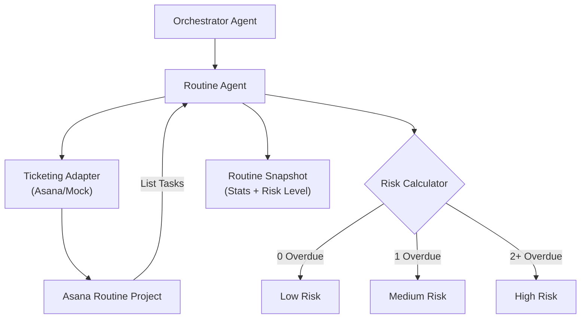

# Routine Agent – Daily Task Tracking & Adherence Risk Assessment

> **Document**: `CareSync/docs/routine_agent.md`
> **Last updated**: 2026-05-01

---

## Goal

The **Routine Agent** is responsible for monitoring a patient's adherence to their daily care plan. It tracks tasks such as medication intake, symptom logging, and exercise, and assesses the "risk level" of the patient's routine based on completed and overdue items. This data is critical for the Orchestrator to decide when to send reminders or escalate to a doctor.

---

## Architecture Diagram



---

## Core Responsibilities

1. **Routine Retrieval**: Fetches the full list of tasks for the current patient from the routine tracking system (Asana).
2. **Adherence Risk Assessment**:
   - **Low Risk**: All tasks are either completed or not yet due.
   - **Medium Risk**: At least one task is due today or one task is overdue.
   - **High Risk**: Two or more tasks are currently overdue, indicating a significant lapse in routine.
3. **Snapshot Generation**: Provides a high-level summary of the patient's daily "health" in terms of task completion (Open vs Overdue vs Due Today).
4. **Context for Comms**: Provides the raw data used by the Communications Agent to craft daily check-in messages.

---

## Risk Logic: `get_routine_snapshot`

The agent performs a quantitative analysis of the task list:
- **`overdue_count`**: Tasks where `due_on < today`.
- **`due_today_count`**: Tasks where `due_on == today`.
- **`open_count`**: Total tasks not yet marked `completed`.
- **`risk_level`**: A categorical label (`low`, `medium`, `high`) derived from the counts.

---

## Agent Schema

```python
class RoutineTaskResponse(BaseModel):
    id: str
    name: str
    completed: bool
    due_on: str | None = None
    patient_id: int | None = None

class RoutineSnapshotResponse(BaseModel):
    tasks: list[RoutineTaskResponse]
    open_count: int
    overdue_count: int
    due_today_count: int
    risk_level: str
    routine_summary: str
```

---

## Validation & Implementation Status

- [x] **Asana Integration**: Verified that `list_routine_tasks` correctly filters by the current patient's identity.
- [x] **Risk Granularity**: Verified that the logic distinguishes between "Due Today" (Medium) and "2+ Overdue" (High).
- [x] **Date Handling**: Verified that `date.today().isoformat()` is used for consistent comparison against Asana's `YYYY-MM-DD` format.
- [x] **Snapshot Accuracy**: Verified that the `routine_summary` string correctly pluralizes and reflects the raw counts.
- [x] **Model Simplicity**: Verified that the agent remains stateless and derives all insights from the live ticketing adapter.

---

## Testing Checklist

- [ ] `adk web src` → Routine Snapshot is visible in the patient dashboard
- [ ] Mark 2 tasks as overdue in Asana → Confirm `risk_level` shifts to "high"
- [ ] Complete all tasks for today → Confirm `risk_level` shifts to "low"
- [ ] Verify `due_today_count` correctly includes tasks scheduled for the current system date
- [ ] Confirm `RoutineTaskResponse` handles tasks with missing `due_on` dates gracefully
- [ ] Test the Orchestrator's "Daily Check-in" to see if it correctly incorporates the Routine Agent's snapshot
