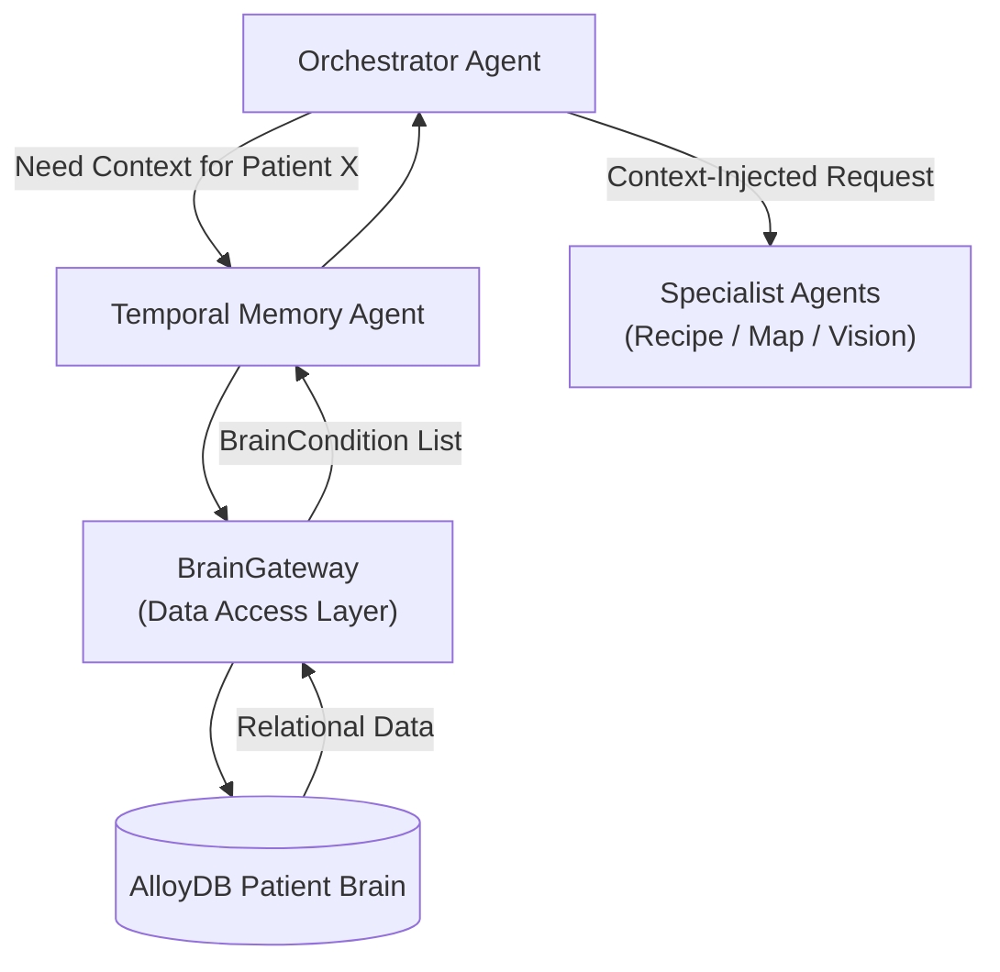

# Temporal Memory Agent – Clinical Context Injection

> **Document**: `CareSync/docs/temporal_memory_agent.md`
> **Last updated**: 2026-05-01

---

## Goal

The **Temporal Memory Agent** serves as the "short-term clinical memory" of the CareSync platform. Its primary goal is to retrieve and serve the most relevant clinical data (active conditions, recent vitals, current prescriptions) for the current patient. This ensures that every specialist agent (Recipe, Map, Vision) is "grounded" in the patient's specific health context, preventing generic or unsafe advice.

---

## Architecture Diagram



---

## Core Responsibilities

1. **Context Retrieval**: Fetches the active chronic conditions for a given patient ID from the relational database.
2. **Specialist Grounding**: Provides the necessary data for the Recipe Agent to perform safety checks (e.g., checking for IBS before recommending a recipe).
3. **Point-in-Time Accuracy**: Ensures that agents are working with the latest "flushed" state of the patient's profile, even during a complex multi-stage conversation.
4. **Data Abstraction**: Decouples the specialist agents from the underlying database schema, providing a clean `BrainCondition` interface.

---

## Agent Logic: `get_relevant_conditions`

The agent acts as a high-performance read layer:
- **Filtering**: Currently retrieves all active conditions linked to the patient.
- **Evolution**: (Planned) Vector search integration to retrieve conditions most semantically relevant to the current conversation topic.

---

## Agent Schema

```python
class BrainCondition(BaseModel):
    id: int
    name: str
    condition_type: str
    last_updated: datetime | None = None
    notes: str | None = None
```

---

## Validation & Implementation Status

- [x] **Relational Mapping**: Verified that the agent correctly interfaces with the `BrainGateway` to query AlloyDB.
- [x] **Interface Consistency**: Verified that it returns a list of `BrainCondition` objects, which are understood by the Diet and Formulary agents.
- [x] **Orchestrator Wiring**: Verified that the Orchestrator initializes a shared `BrainGateway` and passes it to Temporal Memory to minimize connection overhead.
- [x] **Empty State Handling**: Verified that if a patient has 0 conditions, the agent returns an empty list rather than an error.

---

## Testing Checklist

- [ ] `adk web src` → Temporal context is visible in agent logs
- [ ] Add a new condition to Patient 2 → Confirm `TemporalMemoryAgent` returns it immediately in the next request
- [ ] Verify that `get_relevant_conditions` does not include deleted or archived conditions
- [ ] Test shared `BrainGateway` performance during high-frequency intent analysis
- [ ] Confirm `BrainCondition` objects contain properly formatted ISO timestamps for `last_updated`
- [ ] Verify that the Recipe Agent's "Safe for [Conditions]" section reflects the data provided by Temporal Memory
