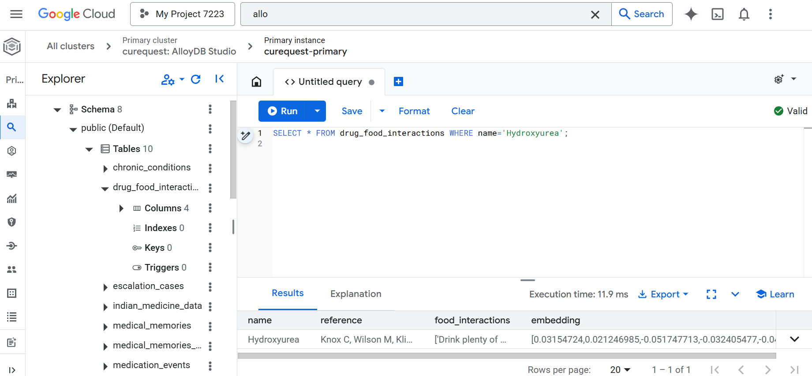
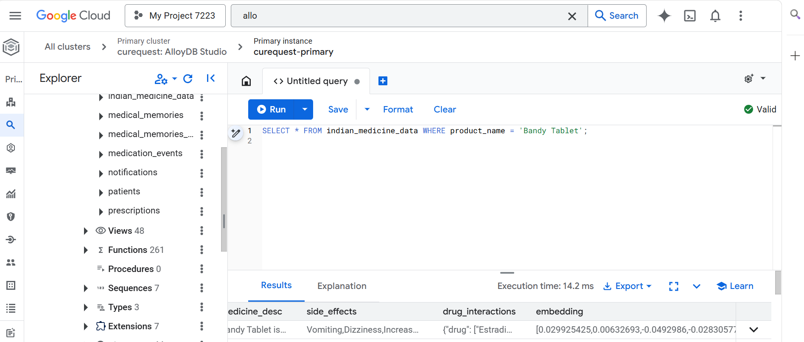
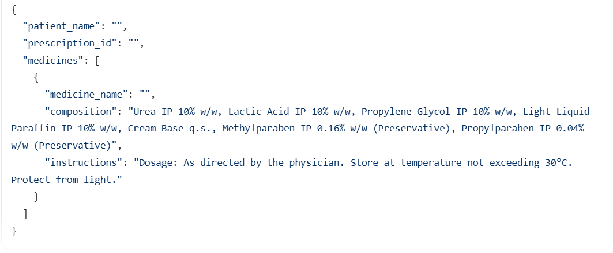
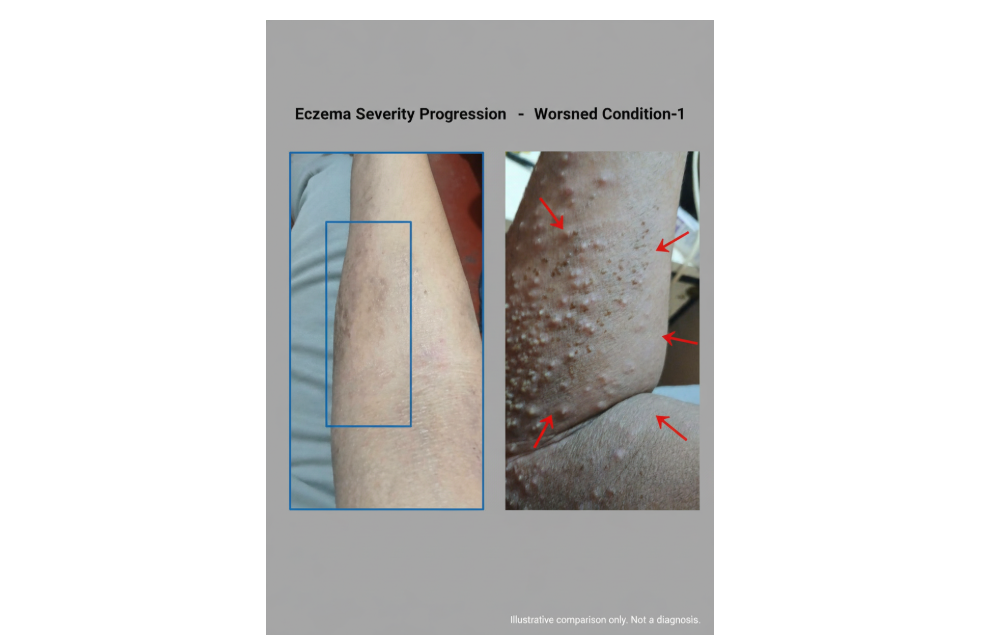
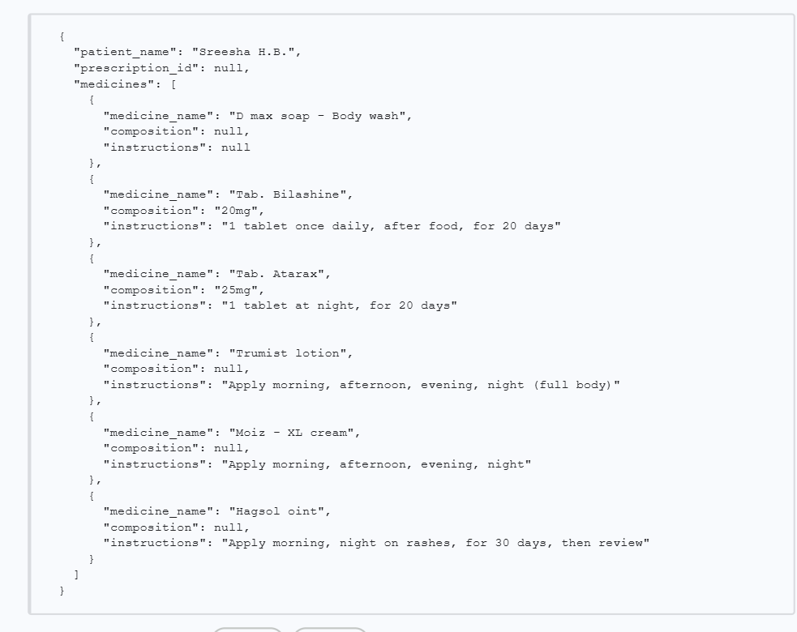
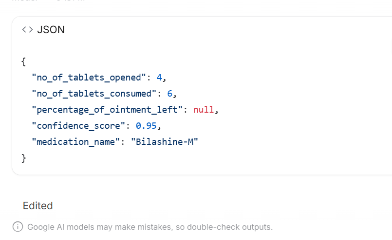
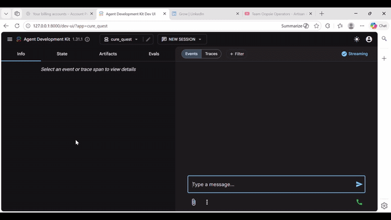

# Metrics Achieved – Performance, Accuracy & Scaling

> **Document**: `CareSync/docs/results_and_metrics.md`
> **Last updated**: 2026-05-01

---

## 1. Database Performance & Latency (AlloyDB)

- The platform leverages AlloyDB for high-performance medical grounding.
- Since real-time chat interference is needed for patients' urgency, AlloyDB offers just that. 
- Below are the benchmarks achieved during stress testing with 176,000+ clinical records.

### Query Latency on 176,000 Rows
The index-optimized search ensures sub-second response times even as the dataset scales.



### AlloyDB Throughput
Remarkable latency characteristics observed during concurrent agent grounding requests.



---

## 2. OCR & Multimodal Classification

- The Vision Agent uses a fallback chain to classify and extract data from medical documents.
- This is before and after the injection of the system prompt analysis.

### OCR Input Quality & Detection
Benchmark tests on various prescription formats (handwritten vs. digital).

.png)

| Sample 2 | Sample 3 |
|----------|----------|
| .png) | .png) |

### Input Transformation (Before & After)
Visualizing the extraction of structured clinical data from raw image inputs.

.png)

---
## 3. System Prompts & Logic

The results shown above are achieved through rigorous system prompting that grounds Gemini's multimodal reasoning in clinical safety and structured output.

### Symptom Analysis Prompt
Used for processing patient-uploaded photos of flares, wounds, or skin conditions.
```text
You are a medical image analysis assistant integrated into a chronic-care management platform called CareSync.
When the user uploads a medical image (symptom photo, skin condition, lab report, prescription scan, etc.) you MUST return a JSON object with exactly these keys:
{
  "severity": "<string: one of 'Mild', 'Moderate', 'Severe', 'Critical', or 'Inconclusive'>",
  "confidence": <integer 0-100>,
  "findings": ["<string>", ...],
  "summary": "<string: 2-4 sentence clinical summary>"
}
Guidelines:
- Be factual and concise. Do NOT diagnose – describe observations only.
- If the image is a prescription or lab report, extract the key information into findings and summarise it.
- ALWAYS respond with valid JSON only – no markdown fences, no extra text.
```

### Pharmaceutical Inspection Prompt
Used for "Physical State Assessment" (counting tablets and verifying ointment usage).
```text
You are an expert pharmaceutical visual inspector. Your task is to analyze images of medication packaging, identify the type of container, extract key medical information, and assess its physical state.

Execution Steps:
Step 1: Container Classification (Blister Pack, Tube, Bottle, etc.)
Step 2: Universal Label Extraction (Brand, Active Ingredients, Warnings)
Step 3: Physical Assessment (Tallying opened/sealed slots, estimating fill level)

Output JSON:
{
  "no_of_tablets_consumed": <integer or null>,
  "no_of_tablets_present": <integer or null>,
  "percentage_of_ointment_left": <float or null>,
  "confidence_score": <float>,
  "medication_name": "<string>"
}
```

### Diagnostic Image Generation Prompt
Used to generate the side-by-side annotated reports.
```text
You are a medical imaging specialist AI that creates professional diagnostic comparison graphics.
LAYOUT:
- White background. Divide the image into two equal vertical panels.
- LEFT PANEL: Show the original uploaded symptom area.
- RIGHT PANEL: Show an annotated medical-diagram view highlighting specific findings.
- HEADER: 'CareSync Diagnostic Report'.
- LEGEND: Numbered text legend reflecting clinical reasoning about severity, progression, or improvement.
```
---

## 4. Model Accuracy & Reasoning

Comparison of Gemini Vision with good system prompts on symptom analysis.

### Accurate Clinical Output
High-fidelity extraction of medication names and dosages.



### Comparative Analysis
Analysis performed by the specialized medical reasoning model compared to general-purpose outputs.



| Output by Gemini | Output by Medsigslip |
|------------------|------------------|
|  |  |

---

## 5. Platform Demo

### Working ADK Multi-Agent Orchestration
A live look at the Orchestrator coordinating between Vision, Recipe, and Comms agents.



---

